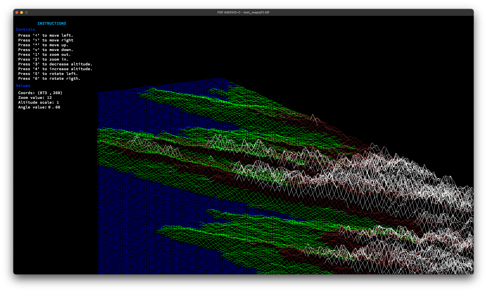

<div align="center">
<h1 align="center">
    <br>FildeFer (FdF)</br>
</h1>
<p align="center">
    
</p>
</div>

## Table of Contents
- [Summary](#-summary)
- [Simple example of functionality](#-simpleexampleoffunctionality)
- [Usage](#-usage)
- [Usage](#-screenshots)
- [Installation](#-installation)


# Summary

### What is "fdf"?
FdF is a project in which we convert a file with a grid of height values into a 3d wireframe using a simple graphics library called MiniLibX.

## Simple example of functionality
The following is an example of a .fdf file we use as an input for our program:

```
0 0 1 2 3 4 5 6 7 8 9
0 0 0 1 2 3 4 5 6 7 8
0 0 0 0 1 2 3 4 5 6 7
0 0 0 0 0 1 2 3 4 5 6
0 0 0 0 0 0 1 2 3 4 5
0 0 0 0 0 0 0 1 2 3 4
0 0 0 0 0 0 0 0 1 2 3
0 0 0 0 0 0 0 0 0 1 2
0 0 0 0 0 0 0 0 0 0 1
```

# Usage

```sh
./fdf [file path]
```

Example: 

```sh
./fdf test_maps/t1.fdf
```
💡 Tip: Instructions for control in the window itself. To exit press esc or close the window.

## Screenshots



## Installation

1. Clone the Libft repository:
```sh
git clone
```

2. Change to the project directory:
```sh
cd fdf
```

3. Compile the library:

    Using Makefile you can create the file push_swap.a<br/>
    Makefile has 4 main options:<br/>
    ```sh
    make
    ```
    to compile C files - create object files and library libft.a
    ```sh
    make clean
    ```
    to remove object files.
    ```sh
    make fclean
    ```
    remove libft.a file.
    ```sh
    make re
    ```
    recompile the library.


[**Return**](#Top)
